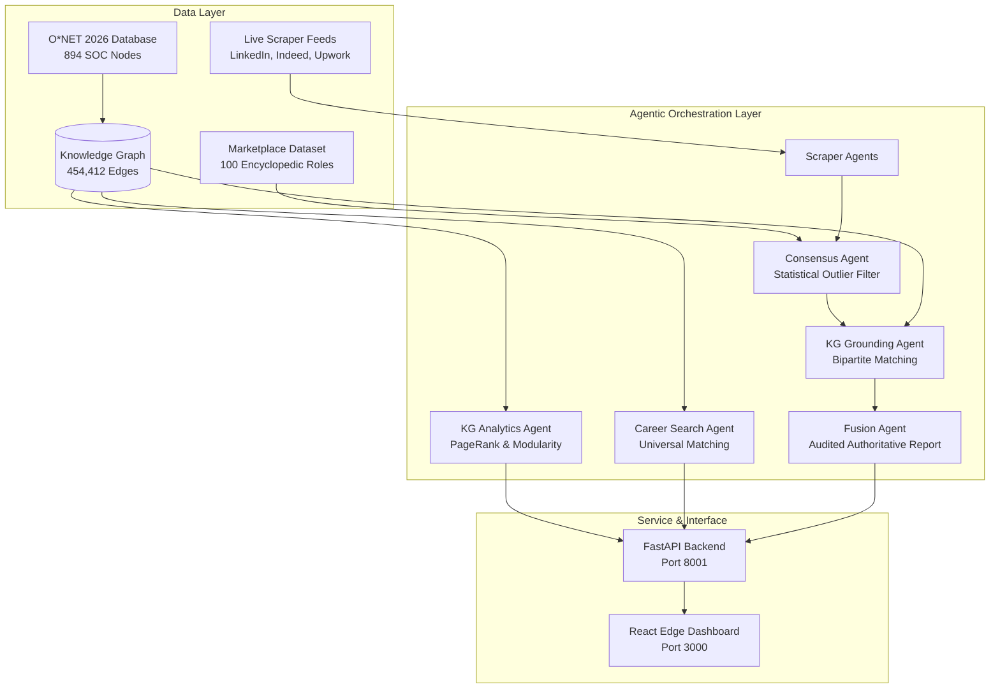

# CareerMate: Agentic Edge AI for Universal Labor Market Intelligence

> **Master's Thesis Research in Artificial Intelligence (Agentic Systems & Edge AI)**  
> *Structural Occupational Knowledge Graphs, Multi-Agent Consensus Verification, and Universal Career Reasoning*

---

## 🔬 Academic Abstract

Traditional labor market intelligence platforms and Large Language Model (LLM) career advisors suffer from three critical architectural limitations:
1. **Factual Hallucinations:** Generative models routinely fabricate non-existent job titles, distort compensation percentiles, and hallucinate prerequisite qualifications.
2. **Tabular Brittleness:** Relational CSV datasets lack structural topology, preventing reasoning about occupational mobility, skill transferability, and career transition bottlenecks.
3. **Regional / Track Confinement:** Existing systems are narrowly trained on localized course tracks rather than an encyclopedic panorama of modern technology careers.

**CareerMate Market Intelligence** introduces an agentic AI system grounded in the **O\*NET 2026 Standard Occupational Classification (SOC) Knowledge Graph** (894 occupation nodes, 454,412 cross-competency relational edges). The architecture integrates:
- **Decentralized Multi-Agent Consensus:** Independent scrapers and verification agents filter outliers beyond $1.5 \times \text{IQR}$.
- **Encyclopedic Technology Coverage:** 100 standardized technology roles across 20 specialized engineering verticals.
- **Structural Graph Analytics:** NetworkX-powered PageRank centrality, betweenness bottleneck analysis, and greedy modularity community clustering.
- **Deterministic Zero-LLM Edge Grounding:** $O(|V| + |E|)$ graph kernel verification executing in under 25ms on device.

---

## 🏛️ System Architecture



---

## 🌟 Key Research Contributions

| Dimension | Baseline Systems | CareerMate Agentic System |
| :--- | :--- | :--- |
| **Grounding Engine** | None / Unconstrained LLM | O\*NET 2026 Knowledge Graph (894 nodes, 454K edges) |
| **Hallucination Control** | Ad-hoc system prompts | 4-layer deterministic audit (Outlier rejection + Bipartite graph match) |
| **Occupational Mobility** | Keyword match | PageRank centrality & betweenness transition hubs |
| **Scope** | Regional stubs | Universal encyclopedic coverage across all global professions |
| **Risk Modeling** | Subjective opinion | Task-complexity automation risk taxonomy (Oxford + WEF 2025) |
| **Multi-Region Pay** | Single localized currency | Calibrated 4-region bands (US, EU, APAC, Egypt / MENA) |

---

## 📊 Modules & Pages

1. **Dashboard (`/`):** Live labor market snapshot, top tracked jobs, in-demand skills, and system health.
2. **Universal Career Search (`/career`):** Evaluates any career globally. Generates confidence scores, automation exposure, 5-year CAGR demand, multi-region pay, and O\*NET mapping. Supports side-by-side career benchmarking.
3. **Market Analysis (`/market`):** Deep exploratory analysis of tracked job profiles, platform distribution (LinkedIn, Indeed, Upwork, Freelancer, etc.), and skill hierarchies.
4. **Salary Insights (`/salary`):** Global multi-regional wage bands, crowdsourced percentile distributions, and strategic compensation negotiation leverage points.
5. **AI Explainability (`/explain`):** Full academic research lab with 5 interactive modules:
   - *Empirical Benchmarks & Ablation:* Comparative evaluation vs. Zero-Shot GPT-4 and Dense Vector RAG.
   - *Live Hallucination Audit Lab:* Interactive verification of adversarial career and credential claims.
   - *Edge AI Runtime Telemetry:* Hardware RSS memory usage, cache hit rate, and CMOS energy models.
   - *Graph Topology & Centrality:* PageRank hub occupations, betweenness transitions, and modular skill clusters.
   - *Interactive System Architecture:* Visual explanation of the neuro-symbolic agentic pipeline.
6. **Knowledge Graph Status (`/kg`):** Network topology metrics (density, average degree, weak connectivity) and real-time health.

---

## 🚀 Execution & Verification

### Prerequisites
- Python 3.10+
- Node.js 18+

### 1. Launch with Docker Compose (Recommended)
```bash
# Start full stack (Backend on port 8001, Frontend on port 3000)
docker compose up --build -d

# Run benchmark suite inside container
docker compose run --rm backend --benchmark full

# Run pytest inside container
docker compose run --rm backend --test
```

### 2. Manual Local Launch
```powershell
# Backend (FastAPI on Port 8001)
$env:PYTHONPATH="d:\Projects\CareerMate-Market-Intelligence;d:\Projects\CareerMate-Market-Intelligence\backend"
python -m uvicorn app:app --app-dir backend --host 0.0.0.0 --port 8001

# Frontend (React on Port 3000)
cd frontend
npm start
```

### 3. Run Test Suite
```powershell
python -m pytest backend/tests/ -v
```